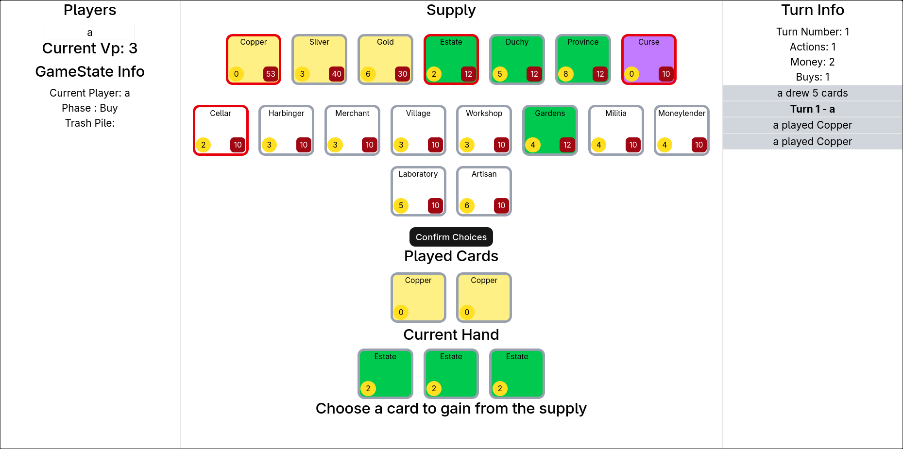

# Dominion Simulator (Name Subject to Change)



A self-hosted game engine for the popular deck building game Dominion.
Heavily inspired by [Dominion-Online](https://dominion.games/),
which is a great option for those who do not want to self host.
Allows you to play dominion with a group of friends remotely through a self-hosted server.
Please consider buying a hard copy of Dominion and any expansions you may like if you enjoy the game
and want to support its creators.

This project is currently still a work in progress so there may be bugs present
and UI is subject to change.

## Currently Supported Expansions

- [Base Set(Second Edition Cards Only)](<https://dominioncg.fandom.com/wiki/Dominion_(Base_Set)>)

## Setup and Installation

1. Clone this repository

```bash
git clone https://github.com/Altakie/dominion-simulator.git
```

2. Install dependencies. We recommend using [Bun](https://bun.com/) as the package manager.

```bash
bun install
```

## Instructions for Self Hosting

To run:

```bash
bun run serve
```

This should start the server at [localhost:3000](localhost:3000), which will make it accessible on your local network
if you are running it on your own machine.

To expose the server outside your local network, or if you hosting the server outside your local network, either [tunnel](https://www.cloudflare.com/learning/network-layer/what-is-tunneling/) localhost:3000 on the host machine, set up [port forwarding](https://en.wikipedia.org/wiki/Port_forwarding) rules, set-up a [Virtual Private Network](https://en.wikipedia.org/wiki/Virtual_private_network), or use any other method you see fit.

## TODOs and Known Bugs

[Todos.md](./Todos.md)

<!-- This project was created using `bun init` in bun v1.3.5. [Bun](https://bun.com) is a fast all-in-one JavaScript runtime. -->
